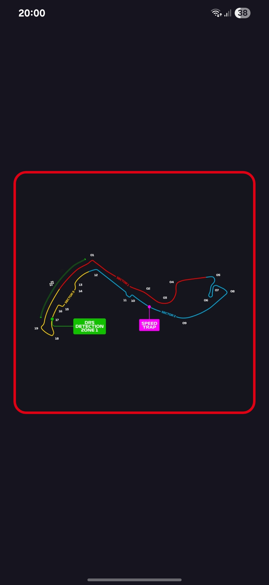
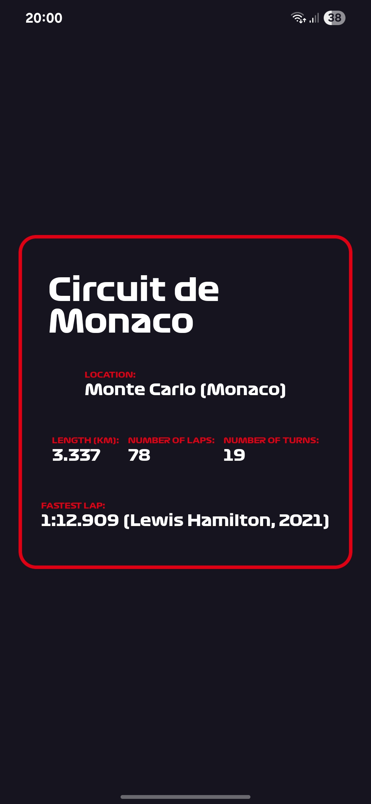

# 🏎️ CircuitCards

A leightweight quiz app about guessing Formula 1 circuits names based on their shape. Built with React Native and Expo.

## ✨ Features
- scrollable, rotatable flashcards with F1 circuits,
- schematic/shape on obverse and detailed info on reverse.

## 📲 Installation

1. **Clone this repository**

   ```bash
   git clone https://github.com/f1shuu/circuitcards.git
   ```

2. **Install dependencies**

   ```bash
   npm i
   ```

3. **Start the project**

   ```bash
   npx expo start
   ```

## 📦 Download
Download the latest Android APK from the [Releases](https://github.com/f1shuu/circuitcards/releases) page.

## 🖼️ Screenshots

<p align="center">
    
    
</p>

## 🛠️ Tech Stack

- React Native,
- Expo.

## 📄 License

This project is licensed under the MIT License.
